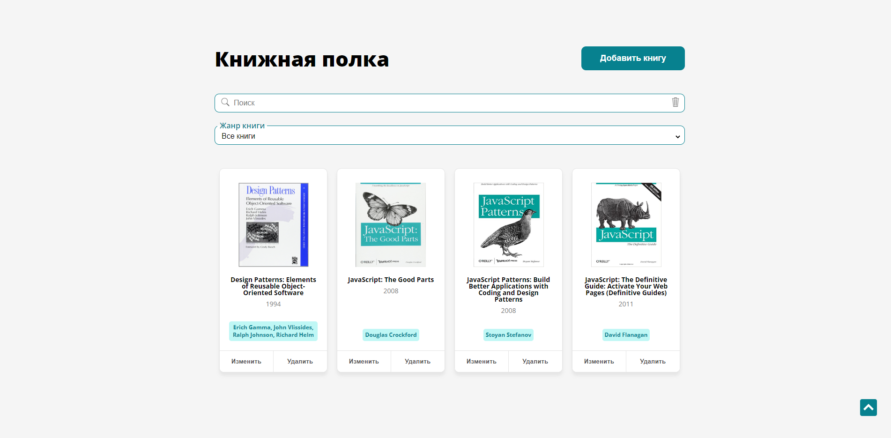

# Bookshelf
Одностраничник для хранения информации о внесенных пользователем книгах.

[Ccылка на проект на Netlify](https://book-shelf-project.netlify.app/)

### Функциональность
Реализована возможность добавления новых книг и их удаления. Можно изменять данные внесенных книг (название, автора, год издания, ссылку на изображение, жанр). Добавлены функции фильтрации книг по жанрам, 
а также поиска по названию, автору книги или по году издания. 

## Используемые технологии
* HTML/CSS;
* JavaScript;
* Адаптивная верстка;
* Flexbox;

